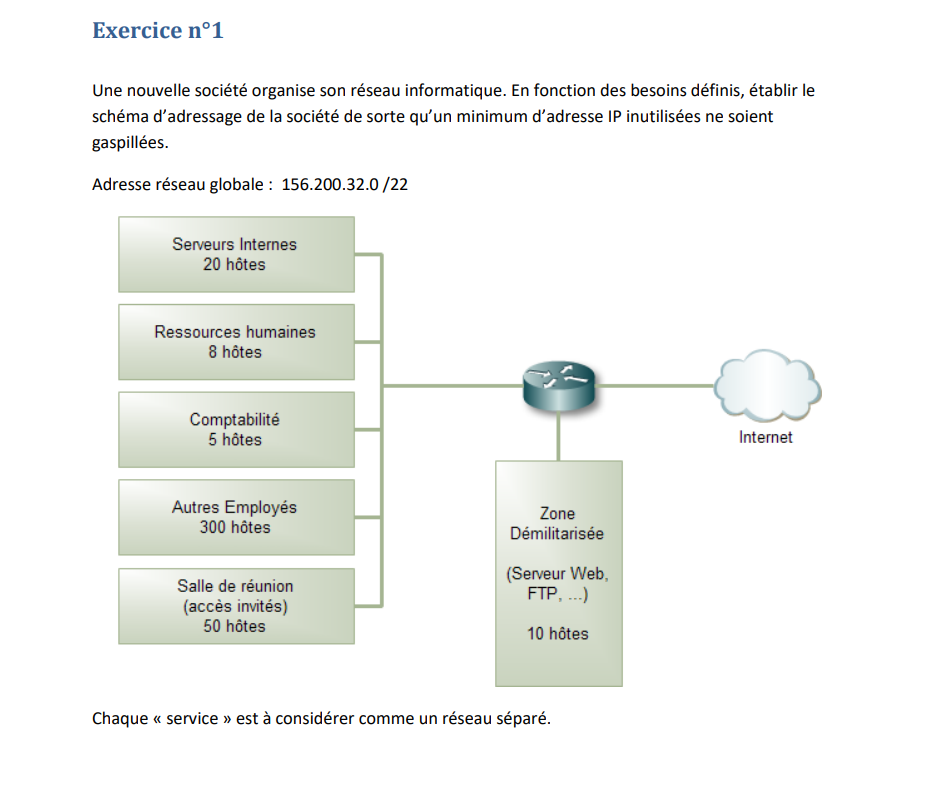
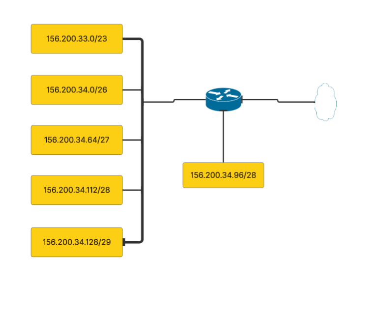
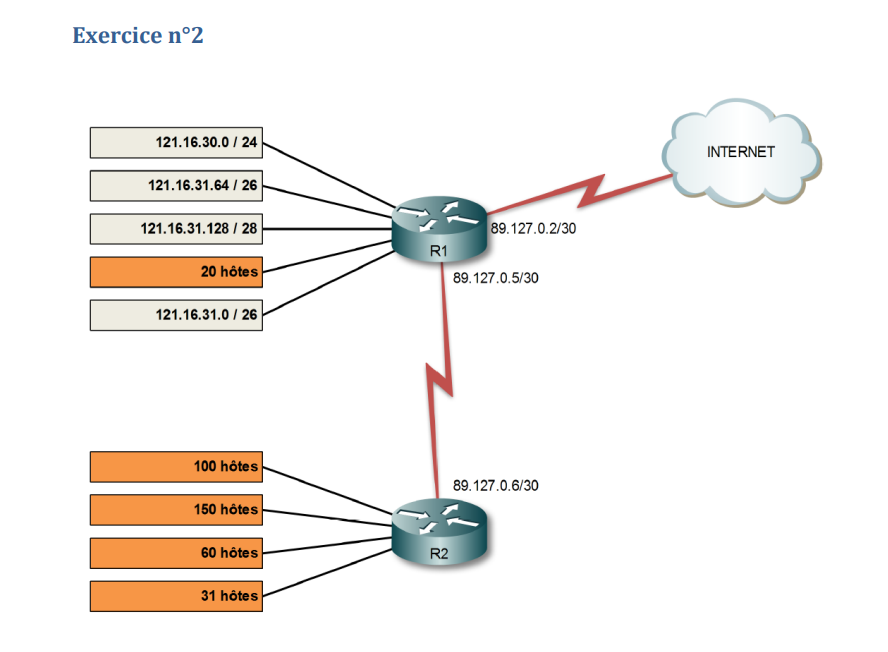
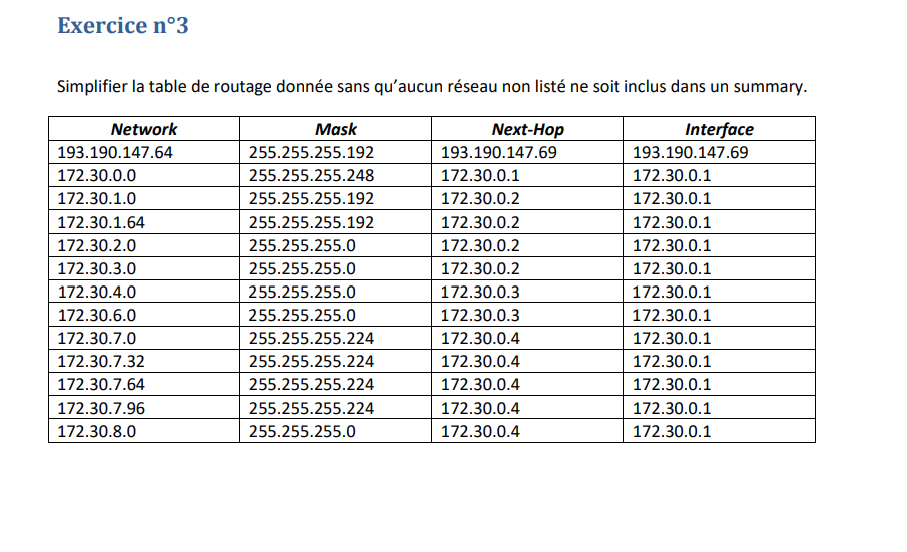

# Network_lab0
Il s'agit du premier laboratoire du cours de réseaux et systèmes informatique.
Dans ce premier laboratoire nous allons aborder l'adressage ainsi que la mise en place de tables de routages.
**Tous les exercices qui suivent ont été corrigés par le professeur en charge de ce laboratoire.**

## Adressage
L’adressage réseau est un élément fondamental des communications informatiques. Il permet aux appareils d’échanger des données au sein d’un réseau local (LAN) ou à travers Internet. Ce laboratoire vise à comprendre les bases de l’adressage IP, les masques de sous-réseau et l’organisation des réseaux pour assurer une communication efficace et structurée.

### Exercice 1
Dans le premier exercice lié à ce laboratoire, nous devons attribuer des plages d'adresses à chaque "service" de l'entreprise, l'adresse global est 156.200.32.0 /22

Je vais vous indiquer la méthode à suivre afin de pouvoir attribuer des adresses sans problèmes.

1- On commence par voir quel service à le plus grand nombre d'hotes (dans notre cas il s'agit dela section "Autres Employés" qui devra compter 300 hotes).

2- En suite nous devons trouver n dans l'équation suivante 2n  = 300, on trouve donc n= 8,22 mais nous allons prendre n = 9 afin d'avoir assez d'adresses (donc ici nous aurons 512 adresses).

3- On peut alors calculer le masque : 32 - 9 = 23 donc le masque ici sera un /23 (ici on utilise 32 car dans une adresse IP s'écrit sous la forme x.x.x.x (ou chaque x represente un octet et donc naturellement on a 8*4 octets

4- Addresses totales -> 156.200.32.0 jusqu'à 156.200.33.255

5- Addresses utilisables par les hotes -> 156.200.32.1 jusqu'à 156.200.33.254 (on enlève 156.200.32.0 car il s'agit de l'adresse du sous réseau et 156.200.33.255 est l'adresse de diffusion (appelé Broadcast))

Et voilà nous avons fini l'adressag pour un service, il nous reste maintenant à faire la meme chose avec les autres services, je vais ici directement afficher les réponses car la méthodologie est la meme.

| Service | Nombre d'hotes |Adresses Totales |Adresses utilisables par les hotes |
| --- | --- |--- |--- |
| Autres employés | 300 | 156.200.32.0 --> 156.200.33.255 | 156.200.32.1 --> 156.200.33.254 |
| Salle de réunion | 50 | 156.200.34.0 --> 156.200.34.63 | 156.200.34.1 --> 156.200.34.62 |
| Serveurs internes | 20 | 156.200.34.64 --> 156.200.34.95 | 156.200.34.65 --> 156.200.34.94 |
| Zone démilitarisée | 10 | 156.200.34.96 --> 156.200.34.111 | 156.200.34.97 --> 156.200.34.110 |
| Ressources humaines | 8 | 156.200.34.112 --> 156.200.34.127 | 156.200.34.113 --> 156.200.34.126 |
| Comptabilité | 5 | 156.200.34.128 --> 156.200.34.135 | 156.200.34.129 --> 156.200.34.134 |

**Attention l'adresse 156.200.34.0 est comptée comme la 1ere adresse donc pour 64 adresses on fait 0+64-1 = 63**

la toute première adresse de la plage des adresses totales est réservé au sous réseau et la dernière adresse est reservé au broadcast

Petit apparté important, voici comment faire pour avoir un masque sous réseau sous la forme /x à partir de la forme x.x.x.x exemple: si on a un masque de 255.255.255.192 alors on fait 256 - 192 = 64 et après il faut résoudre cette équation 2n  = 64 on trouve donc n = 6 et donc on fait 32 - 6 = 26 donc le masque de sous réseau peut s'écrire comme celà /26

Voilà le réseau avec les sous réseaux mis en place : 

### Exercice 2

Pour ce deuxième exercice, nous devons faire de l'adressage d'un service de 20 hotes, les autres services ont déjà leur plages d'adresses

donc nous pouvons déduire ceci pour R1 (le routeur 1) (adresse global => 121.16.30.0 /23) :

| Nombre d'hotes |Adresses Totales |Adresses utilisables par les hotes |
| --- |--- |--- |
| 256 | 121.16.30.0 --> 121.16.30.255 | 121.16.30.1 --> 121.16.30.254 |
| 64 | 121.16.31.0 --> 121.16.31.63 | 121.16.31.1 --> 121.16.31.62 |
| 64 | 121.16.31.64 --> 121.16.31.127 | 121.16.31.65 --> 121.16.31.94 |
| 16 | 121.16.31.128 --> 121.16.31.143 | 121.16.31.129 --> 121.16.31.142 |
| 20 | 121.16.31.160 --> 121.16.31.191 | 121.16.31.161 --> 121.16.31.190 |

Pourquoi il y a un trou entre les 2 dernières lignes ? (en termes d'adresses IP) puisque nous n'avons pas respecté la règle principale : "Commencer par les unités avec le plus grand nombre d'hotes" et donc pour 20 hotes nous avons un n = 5 donc 32 hotes (c'est le mieux que nous puissions faire) donc l'adresse doit obligatoirement commencer par un multiple de 32 (0,32,96,128,160,192) or la dernière adresse est .143 nous ne pouvons pas utiliser .144 car ce n'est pas un multiple de 32 donc on commence dès le multiple le plus proche (dans ce cas .160)

Pour ce qui est du R2 (routeur 2) (adresse global => 121.16.32.0 /20) nous avons  :

- 150 hotes donc 28 = 256 => c'est un /24, nous pouvons donc déduire la plage d'adresses totales qui sera la suivante : 121.16.32.0 -> 121.16.32.255 (/24)

- 100 hotes donc 27 = 128 => c'est un /25, nous pouvons donc déduire la plage d'adresses totales qui sera la suivante : 121.16.33.0 -> 121.16.32.127 (/25) (**Car .0 est comptée comme une adresse**)

- 60 hotes donc 26 = 64 => c'est un /26, nous pouvons donc déduire la plage d'adresses totales qui sera la suivante : 121.16.33.128 -> 121.16.32.191 (/26) (**on peut remarquer que ce réseau ne doit commencer que par un multiple de 64 et ici c'est bien le cas(ce n'est qu'une coincidence)**)

- 31 hotes donc 26 = 64 => c'est un /26, nous pouvons donc déduire la plage d'adresses totales qui sera la suivante : 121.16.33.192 -> 121.16.32.255 (/26)

Nousavons auss le sous réseau reliant R1 et R2 (la preière et deuxième adresse IP disponibles pour les hotes ont été donné aux interfaces (c'est généralement le cas) donc on peut en déduire l'adresse globale 89.127.0.4 /30 (32 - 30 = 2 donc 22 = 4 donc on a 4 adresses au total)

N'oublions pas aussi d'attribuer la première IP disponible pour les hotes aux interfaces des routeurs reliés à chaque sous-réseaux.

A partir d'ici nous en avons fini avec l'adressage et nous allons donc entamer les exercices concernant les tables de routage ainsi que les simplification de ces dernières (une partie de l'exercice 2 et l'exercice 3)

Pour effectuer la table de routage nous devons tout simplement voir quel chemin doit prendre le routeur pour atteindre un sous-réseau. Faisons un exemple avec le routeur R1, si nous voulons atteindre le sous-réseau 121.16.30.0/24 on remarque qu'il est directement connecté au Routeur 1, pour indiquer celà sur la table de routage soit nous indiquons la meme adresse dans la colonne Interface et dans la colonne Next-Hop ou bien on peut écrire "c" pour dire "fully connected" sinon le Next-hop design la prochaine interface à laquelle il faut y aller pour atteindre un certain sous-réseau alors que la colonne "interface" c'est l'interface de sortie. (**Attention la table de routage ici n'est pas simplifiée**

Voici à quoi ressemble la table de routage du routeur 1 :

| n° |Network (destination) |Mask |Next-Hop |Interface |
|--- | --- |--- |--- |--- |
| 1| 121.16.30.0 | /24 | 121.16.30.1 |121.16.30.1 |
| 2| 121.16.31.64 | /26 | 121.16.31.65 |121.16.31.65 |
| 3| 121.16.31.0 | /26 | 121.16.31.1 |121.16.31.1 |
| 4| 121.16.31.128 | /28 | 121.16.31.129 |121.16.31.129 |
| 5| 121.16.31.160 | /27 | 121.16.31.161 |121.16.31.161 |
| -----| ----- | ----- | -----|----- |
| 6| 121.16.32.0 | /24 | 89.127.0.6 |89.127.0.5 |
| 7| 121.16.33.0 | /25 | 89.127.0.6 |89.127.0.5 |
| 8| 121.16.33.128 | /26 | 89.127.0.6 |89.127.0.5 |
| 9| 121.16.33.192 | /26 | 89.127.0.6 |89.127.0.5 |
| 10| 89.127.0.4 | /30 | 89.127.0.5 |89.127.0.5 |

Dans la première partie de cette table de routage nous avons tous les réseaux qui sont directement connectés au routeur, pour la deuxième partie du tableau il s'agit des sous réseaux uniquement accessibles via R2, nous pouvons simplifier cette table, il faut que le next-hop et la colonne interface soient les memes et s'il n'y a pas de trous entre les adresses, pour ce tableau là ça donne le tableau suivant :

| n° |Network (destination) |Mask |Next-Hop |Interface |
|--- | --- |--- |--- |--- |
| 1| 121.16.30.0 | /24 | 121.16.30.1 |121.16.30.1 |
| 2| 121.16.31.64 | /26 | 121.16.31.65 |121.16.31.65 |
| 3| 121.16.31.0 | /26 | 121.16.31.1 |121.16.31.1 |
| 4| 121.16.31.128 | /28 | 121.16.31.129 |121.16.31.129 |
| 5| 121.16.31.160 | /27 | 121.16.31.161 |121.16.31.161 |
| -----| ----- | ----- | -----|----- |
| 6| 121.16.32.0 | /20 | 89.127.0.6 |89.127.0.5 |
| 7| 89.127.0.4 | /30 | 89.127.0.5 |89.127.0.5 |

Nous avons donc simplifier la table de routage de R1, faisons donc de meme pour R2 maintenant.

| n° |Network (destination) |Mask |Next-Hop |Interface |
|--- | --- |--- |--- |--- |
| 1| 0.0.0.0 | /0 | 89.127.0.5 |89.127.0.6 |
| 2| 121.16.30.0 | /24 | 89.127.0.6 |89.127.0.5 |
| 3| 121.16.31.64 | /26 | 89.127.0.6 |89.127.0.5 |
| 4| 121.16.31.0 | /26 | 89.127.0.6 |89.127.0.5 |
| 5| 121.16.31.128 | /28 | 89.127.0.6 |89.127.0.5 |
| 6| 121.16.31.160 | /27 | 89.127.0.6 |89.127.0.5 |
| -----| ----- | ----- | -----|----- |
| 7| 121.16.32.0 | /24 | 121.16.32.1 |121.16.32.1 |
| 8| 121.16.33.0 | /25 | 121.16.33.1 |121.16.33.1 |
| 9| 121.16.33.128 | /26 | 121.16.33.129 |121.16.33.129 |
| 10| 121.16.33.192 | /26 | 121.16.33.193 |121.16.33.193 |
| 11| 89.127.0.4 | /30 | 89.127.0.6 |89.127.0.6 |

Et voici la table de routage simplifié :

| n° |Network (destination) |Mask |Next-Hop |Interface |
|--- | --- |--- |--- |--- |
| 1| 0.0.0.0 | /0 | 89.127.0.5 |89.127.0.6 |
| 2| 121.16.30.0 | /23 | 89.127.0.6 |89.127.0.5 |
| -----| ----- | ----- | -----|----- |
| 3| 121.16.32.0 | /24 | 121.16.32.1 |121.16.32.1 |
| 4| 121.16.33.0 | /25 | 121.16.33.1 |121.16.33.1 |
| 5| 121.16.33.128 | /26 | 121.16.33.129 |121.16.33.129 |
| 6| 121.16.33.192 | /26 | 121.16.33.193 |121.16.33.193 |
| 7| 89.127.0.4 | /30 | 89.127.0.6 |89.127.0.6 |

### Exercice 3

nous devons simplifier cette table 

Voici ce que donne la table simplifié (on regarde bie si le next-hop et l'interface sont bien les memes et aussi s'il n'y a pas de discontinuitée au niveau des adresses attribués)
| n° |Network (destination) |Mask |Next-Hop |Interface |
|--- | --- |--- |--- |--- |
| 1| 193.190.147.64| /26 | 193.190.147.69 |193.172.30.0.1 |
| 2| 172.30.0.0 | /29 | 172.30.0.1 |172.30.0.1 |
| 3| 172.30.1.0 | /25 | 172.30.0.2 |172.30.0.1 |
| 4| 172.30.2.0 | /23 | 172.30.0.2 |172.30.0.1 |
| 5| 172.30.7.0 | /25 | 172.30.0.4 |172.30.0.1 |
| 6| 172.30.8.0 | /24 | 172.30.0.4 |172.30.0.1 |
| 7| 172.30.4.0 | /24 | 172.30.0.3 |172.30.0.1 |
| 8| 172.30.6.0 | /24 | 172.30.0.3 |172.30.0.1 |

## Méthodes d'écriture du masque

Si j'ai le masque 255.255.240.0 et que je veux obtenir l'écriture CIDR alors voici les étapes à suivre
1 - (256-240) = 16
2 - log2(16) = 4
3 - (8 - 4) = 4
4 - 2*8 + 4 = 20 (ici on a fait fois 2 car nous avons 2 octets pleins)
5 - /20

Si je veux passer de /20 à l'autre écriture alors :
1 - 20//8 = 2,5 = 2 (j'arrondis, ici 2 indque le nombre d'octets pleins)
2 - 20 % 8 = 4 (il s'agit ici du reste de la division 2*8 = 16 + 4(le reste pour atteindre 20)
3 - (256 - 28-4) = 240
4 - 255.255.240.0
